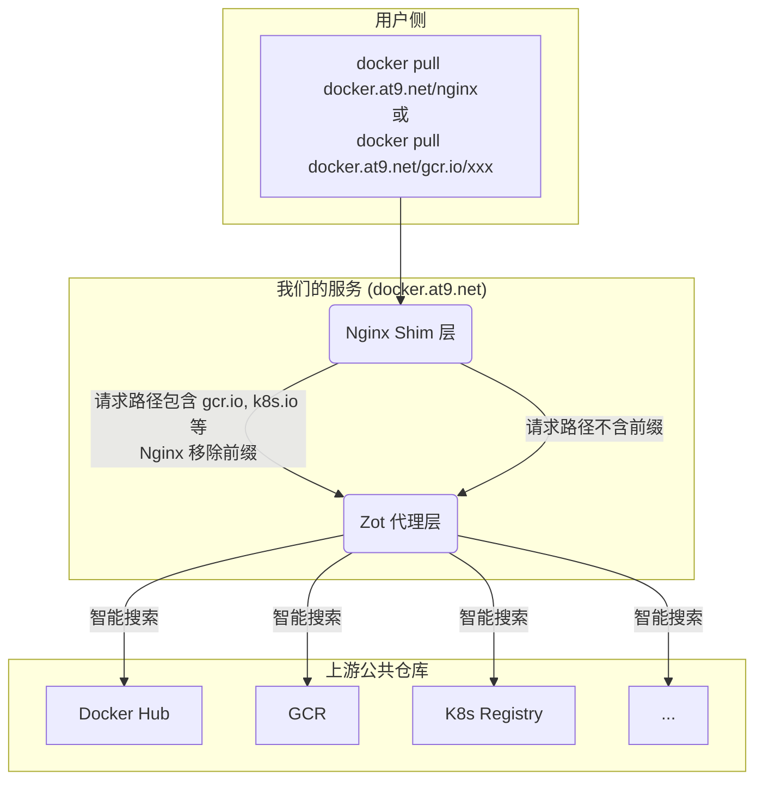

# Zot 公益镜像仓库

🚀 **高速、稳定、免费的容器镜像加速服务**  
访问地址: [docker.at9.net](https://docker.at9.net)

---

## 🎉 最新更新
- 支持 7 个主流容器仓库
- 提供隐式智能搜索和显式路径指定两种模式
- 极致的镜像拉取体验

---

## ⚡️ 核心用法

### 模式一：隐式智能搜索（推荐）
直接拉取镜像，服务会自动在所有上游仓库中寻找。

```bash
# Zot 会自动在所有源中寻找 nginx，最终在 Docker Hub 找到
docker pull docker.at9.net/nginx:latest

# Zot 会自动寻找 pause，最终在 registry.k8s.io 找到
docker pull docker.at9.net/pause:3.9

# Zot 会自动寻找 distroless/static-debian11, 最终在 gcr.io 找到
docker pull docker.at9.net/distroless/static-debian11:latest
```

### 模式二：显式路径指定
在镜像路径前加上源仓库地址作为前缀，实现精确路由。

| 原始仓库           | 显式拉取命令示例                                               |
|--------------------|--------------------------------------------------------------|
| Docker Hub         | `docker pull docker.at9.net/docker.io/library/nginx:latest`   |
| gcr.io             | `docker pull docker.at9.net/gcr.io/distroless/static-debian11:latest` |
| registry.k8s.io    | `docker pull docker.at9.net/registry.k8s.io/pause:3.9`        |
| quay.io            | `docker pull docker.at9.net/quay.io/prometheus/prometheus:v2.53.0` |
| mcr.microsoft.com  | `docker pull docker.at9.net/mcr.microsoft.com/dotnet/runtime:8.0` |
| ghcr.io            | `docker pull docker.at9.net/ghcr.io/project-zot/zot-linux-amd64:v2.1.4` |
| k8s.gcr.io (兼容)  | `docker pull docker.at9.net/registry.k8s.io/etcd:3.5.9-0`     |

---

## ⚙️ 配置镜像源（推荐）

### Docker 配置
编辑 `/etc/docker/daemon.json`（如无则新建），重启 Docker 服务：

```json
{
  "registry-mirrors": ["https://docker.at9.net"]
}
```

配置后可直接运行 `docker pull nginx:latest`，请求会自动加速。

### Kubernetes (containerd) 配置
编辑 `/etc/containerd/config.toml`，在 `[plugins."io.containerd.grpc.v1.cri".registry.mirrors]` 下为每个上游仓库添加 endpoint：

```toml
[plugins."io.containerd.grpc.v1.cri".registry.mirrors]
  [plugins."io.containerd.grpc.v1.cri".registry.mirrors."docker.io"]
    endpoint = ["https://docker.at9.net"]
  [plugins."io.containerd.grpc.v1.cri".registry.mirrors."registry.k8s.io"]
    endpoint = ["https://docker.at9.net"]
  [plugins."io.containerd.grpc.v1.cri".registry.mirrors."gcr.io"]
    endpoint = ["https://docker.at9.net"]
  # ...为 quay.io, mcr.microsoft.com, ghcr.io 添加类似配置
```

---

## 🔧 工作原理
本服务采用 Nginx + Zot 的强大组合架构，兼顾灵活性与性能。

### 路由决策流程图



- **Nginx Shim 层**：作为流量入口，解析请求。若为显式路径（如 .../gcr.io/...），智能移除前缀，传递"干净"路径给后端。
- **Zot 代理层**：接收 Nginx 请求，执行隐式智能搜索，按预设顺序在所有上游仓库中查找镜像，找到后缓存并返回。

---

## 📞 服务状态与反馈
- 服务首页: [https://docker.at9.net](https://docker.at9.net)
- API 健康检查: `curl https://docker.at9.net/v2/`（应返回 `{}`）
- 项目地址: [https://github.com/htazq/container-mirror-for-china](https://github.com/htazq/container-mirror-for-china)
- 问题反馈: 如有任何问题或建议，请在 Issues 页面提交
- ⭐ 如果这个项目对您有帮助，请给个 Star！
