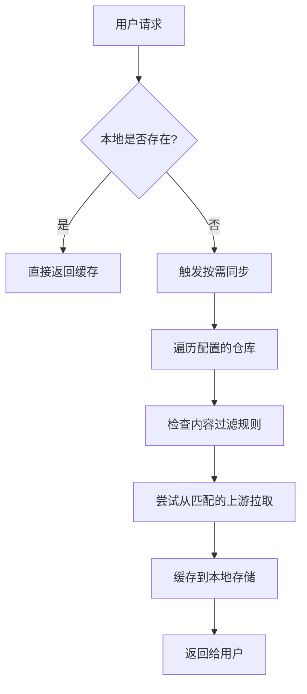

# Zot 公益镜像仓库

🚀 **高速、稳定、免费的容器镜像加速服务**

专为中国大陆开发者提供的容器镜像加速服务，基于 [Zot](https://zotregistry.dev/) 构建，支持 Docker Hub、gcr.io、registry.k8s.io、quay.io 等主流镜像源的自动同步与缓存。

## 🌐 服务地址

- **镜像仓库**: `docker.at9.net`
- **Web UI**: [https://docker.at9.net](https://docker.at9.net)

## 📋 支持的镜像源

| 原始仓库 | 访问方式 | 说明 |
|---------|---------|------|
| Docker Hub | `docker.at9.net/library/{镜像名}` | Docker 官方镜像库 |
| gcr.io | `docker.at9.net/{gcr.io原路径}` | Google Container Registry |
| registry.k8s.io | `docker.at9.net/{k8s镜像名}` | Kubernetes 官方镜像仓库 |
| k8s.gcr.io | `docker.at9.net/{k8s镜像名}` | Kubernetes 镜像（兼容重定向） |
| quay.io | `docker.at9.net/{quay.io原路径}` | Red Hat Quay 镜像仓库 |

## 🚀 使用方法

### 🎯 超简单使用 - 只需加前缀！

**原理**：在任何镜像路径前加上 `docker.at9.net/`，系统自动识别来源并加速下载！

```bash
# 基本语法：在原始镜像路径前加 docker.at9.net/
docker pull docker.at9.net/{原始完整镜像路径}
```

### 📝 实用案例

#### Docker Hub 镜像（最常用）
```bash
# 官方镜像 - 直接加前缀
docker pull docker.at9.net/nginx:latest
docker pull docker.at9.net/node:18-alpine
docker pull docker.at9.net/mysql:8.0
docker pull docker.at9.net/redis:7-alpine

# 用户镜像 - 保持原路径
docker pull docker.at9.net/bitnami/nginx:latest
docker pull docker.at9.net/tensorflow/tensorflow:2.12.0
```

#### Kubernetes 官方镜像
```bash
# K8s 核心组件
docker pull docker.at9.net/kube-apiserver:v1.28.0
docker pull docker.at9.net/kube-controller-manager:v1.28.0
docker pull docker.at9.net/pause:3.9
docker pull docker.at9.net/coredns/coredns:v1.10.1
```

#### Google Container Registry (gcr.io)
```bash
# Google 官方镜像
docker pull docker.at9.net/distroless/static-debian11:latest
docker pull docker.at9.net/google.com/cloudsdktool/cloud-sdk:latest
```

#### Quay.io 镜像
```bash
# 企业级镜像
docker pull docker.at9.net/coreos/etcd:latest
docker pull docker.at9.net/prometheus/prometheus:latest
```

## ⚙️ Kubernetes 中使用

### Pod/Deployment 配置
```yaml
apiVersion: apps/v1
kind: Deployment
metadata:
  name: nginx-deployment
spec:
  template:
    spec:
      containers:
      - name: nginx
        # 原地址: nginx:latest → 加速地址: docker.at9.net/nginx:latest
        image: docker.at9.net/nginx:latest
      - name: redis
        # 原地址: redis:7-alpine → 加速地址: docker.at9.net/redis:7-alpine  
        image: docker.at9.net/redis:7-alpine
```

### K8s 系统组件配置
```yaml
# 原地址: registry.k8s.io/kube-apiserver:v1.28.0
# 加速地址: docker.at9.net/kube-apiserver:v1.28.0
apiVersion: v1
kind: Pod
metadata:
  name: kube-apiserver
spec:
  containers:
  - name: kube-apiserver
    image: docker.at9.net/kube-apiserver:v1.28.0
```

## 🔧 配置 Docker 镜像源（推荐）

一次配置，永久加速！

### Linux/macOS
编辑 `/etc/docker/daemon.json`:
```json
{
  "registry-mirrors": [
    "https://docker.at9.net"
  ]
}
```

### Windows (Docker Desktop)
在设置中添加镜像源：
```
https://docker.at9.net
```

重启 Docker：
```bash
sudo systemctl restart docker
```

配置后可直接使用原始镜像名：
```bash
# 配置镜像源后，直接拉取即可自动加速
docker pull nginx:latest
docker pull node:18-alpine
```

## 🎯 Kubernetes 集群镜像源配置

### containerd 运行时（推荐）

编辑 `/etc/containerd/config.toml`：
```toml
[plugins."io.containerd.grpc.v1.cri".registry]
  [plugins."io.containerd.grpc.v1.cri".registry.mirrors]
    [plugins."io.containerd.grpc.v1.cri".registry.mirrors."docker.io"]
      endpoint = ["https://docker.at9.net"]
    [plugins."io.containerd.grpc.v1.cri".registry.mirrors."registry.k8s.io"]  
      endpoint = ["https://docker.at9.net"]
    [plugins."io.containerd.grpc.v1.cri".registry.mirrors."gcr.io"]
      endpoint = ["https://docker.at9.net"]
    [plugins."io.containerd.grpc.v1.cri".registry.mirrors."quay.io"]
      endpoint = ["https://docker.at9.net"]
```

重启 containerd：
```bash
sudo systemctl restart containerd
sudo systemctl restart kubelet
```

### CRI-O 运行时

编辑 `/etc/containers/registries.conf`：
```toml
[[registry]]
prefix = "docker.io"
location = "docker.io"
[[registry.mirror]]
location = "docker.at9.net"

[[registry]]
prefix = "registry.k8s.io"
location = "registry.k8s.io"
[[registry.mirror]]
location = "docker.at9.net"

[[registry]]
prefix = "gcr.io"
location = "gcr.io" 
[[registry.mirror]]
location = "docker.at9.net"

[[registry]]
prefix = "quay.io"
location = "quay.io"
[[registry.mirror]]
location = "docker.at9.net"
```

重启 CRI-O：
```bash
sudo systemctl restart crio
sudo systemctl restart kubelet
```

### 验证配置
```bash
# 测试 Pod 拉取镜像速度
kubectl run test-pod --image=nginx:latest --rm -it --restart=Never

# 查看节点镜像拉取事件
kubectl get events --field-selector type=Normal | grep Pulled
```

### kubeadm 集群初始化
```bash
# 初始化时指定镜像仓库
kubeadm init --image-repository=docker.at9.net

# 或预拉取镜像
kubeadm config images pull --image-repository=docker.at9.net
```

### K3s 轻量级集群配置

K3s 使用专门的配置文件，不是标准的 containerd 配置。

#### 方法一：registries.yaml 配置文件

创建 `/etc/rancher/k3s/registries.yaml`：
```yaml
mirrors:
  docker.io:
    endpoint:
      - "https://docker.at9.net"
  registry.k8s.io:
    endpoint:
      - "https://docker.at9.net"
  gcr.io:
    endpoint:
      - "https://docker.at9.net"
  quay.io:
    endpoint:
      - "https://docker.at9.net"
  # 兼容旧版本 K8s 镜像
  k8s.gcr.io:
    endpoint:
      - "https://docker.at9.net"
```

重启 K3s：
```bash
# K3s Server 重启
sudo systemctl restart k3s

# 或 K3s Agent 重启  
sudo systemctl restart k3s-agent
```

#### 方法二：启动参数配置

在 K3s 启动时指定镜像仓库：
```bash
# Server 启动时配置
curl -sfL https://get.k3s.io | INSTALL_K3S_EXEC="--system-default-registry=docker.at9.net" sh -

# 或者编辑 /etc/systemd/system/k3s.service
ExecStart=/usr/local/bin/k3s server --system-default-registry=docker.at9.net
```

#### 验证 K3s 配置
```bash
# 检查 K3s 是否识别镜像源配置
sudo k3s crictl info | grep -A 10 "registry"

# 测试拉取镜像
sudo k3s crictl pull nginx:latest

# 创建测试 Pod
kubectl run k3s-test --image=nginx:latest --rm -it --restart=Never
```

#### K3s 常见镜像预热
```bash
# 预拉取 K3s 系统组件（可选）
sudo k3s crictl pull docker.at9.net/pause:3.6
sudo k3s crictl pull docker.at9.net/coredns/coredns:1.10.1
sudo k3s crictl pull docker.at9.net/traefik:v2.10
```

## 📊 技术特性

- ✅ **智能路由**: 自动识别镜像来源，无需手动指定仓库路径  
- ✅ **按需同步**: 首次请求时自动从上游拉取，后续访问极速缓存
- ✅ **自动重试**: 同步失败时最多重试 3 次，重试间隔 5 分钟
- ✅ **安全可靠**: 所有上游连接启用 TLS 验证，确保镜像安全
- ✅ **智能缓存**: 自动垃圾回收，优化存储空间使用
- ✅ **多架构支持**: 完美支持 amd64、arm64 等多种架构
- ✅ **友好界面**: 提供直观的 Web 管理界面

## 📈 服务状态检查

### 快速检测连通性
```bash
# 检查服务是否正常
curl -I https://docker.at9.net/v2/

# 查看已缓存的镜像列表
curl https://docker.at9.net/v2/_catalog
```

### Web 管理界面
访问 [https://docker.at9.net](https://docker.at9.net) 可以：
- 🔍 浏览和搜索镜像
- 📋 查看镜像标签和详细信息  
- 📊 监控同步状态和缓存情况

## ❓ 常见问题解答

### Q: 为什么第一次拉取会比较慢？
A: 首次拉取需要从上游同步到本地缓存，后续访问会极速响应。建议团队提前预热常用镜像。

### Q: 支持私有仓库的镜像吗？
A: 目前仅支持公开访问的镜像。私有镜像请继续使用原始仓库地址。

### Q: 如何确认镜像已经缓存？
A: 可通过 Web 界面查看，或者观察拉取速度（缓存的镜像拉取速度极快）。

### Q: 拉取失败怎么办？
A: 
1. 检查镜像名称和标签是否正确
2. 确认上游仓库中该镜像确实存在
3. 稍后重试（可能是临时网络问题）
4. 查看 Web 界面了解同步状态

### Q: 能否替代所有镜像仓库？
A: 本服务主要加速常用的公开镜像，特殊需求建议保留原始仓库作为备选方案。

## 💡 最佳实践

### 开发环境
```bash
# 常用开发镜像预热
docker pull docker.at9.net/node:18-alpine
docker pull docker.at9.net/python:3.11-slim  
docker pull docker.at9.net/nginx:alpine
docker pull docker.at9.net/redis:7-alpine
```

### 生产环境
```bash
# K8s 集群组件
docker pull docker.at9.net/pause:3.9
docker pull docker.at9.net/coredns/coredns:v1.10.1
docker pull docker.at9.net/kube-apiserver:v1.28.0
```

### CI/CD 流水线
```yaml
# 在 CI/CD 配置中使用加速镜像
services:
  - name: docker.at9.net/docker:dind
  - name: docker.at9.net/redis:7-alpine
```

## 🔗 相关链接

- [Zot 官方文档](https://zotregistry.dev/)
- [Docker 官方文档](https://docs.docker.com/)
- [Kubernetes 镜像最佳实践](https://kubernetes.io/docs/concepts/containers/images/)

## 📄 许可证

本项目基于 MIT 许可证开源。

## 🤝 贡献与反馈

如有问题或建议，欢迎提交 Issue 或 Pull Request。

---

**⭐ 如果这个项目对您有帮助，请给我们一个 Star！**

## 🔧 技术原理深度解析

### 智能路由工作机制

**Zot 如何判断镜像来源？**

Zot 采用 **内容前缀匹配 + 按需同步** 的智能路由策略：

#### 1. 配置驱动的路由规则
```yaml
# 每个上游仓库都有明确的内容过滤规则
{
  "urls": ["https://registry.k8s.io"],
  "content": [
    {
      "prefix": "**",          # 匹配所有路径
      "destination": ""        # 存储到根目录
    }
  ]
}
```

#### 2. 请求处理流程


#### 3. 智能匹配优先级
1. **精确匹配** - 优先匹配具体仓库配置
2. **通配符匹配** - `**` 匹配所有内容
3. **配置顺序** - 按 YAML 配置中的顺序尝试
4. **内容过滤** - 每个仓库的 `prefix` 规则

### 重复镜像处理策略

**为什么不会有重复？**

#### 1. 统一存储路径
```bash
# 所有镜像按统一路径存储
/var/lib/registry/
├── nginx/           # Docker Hub 官方镜像
├── kube-apiserver/  # K8s 官方镜像  
└── distroless/      # GCR 镜像
```

#### 2. 内容去重机制
```json
{
  "storage": {
    "dedupe": true,        // 启用内容去重
    "gc": true,           // 自动垃圾回收
    "gcInterval": "24h"   // 清理周期
  }
}
```

#### 3. 镜像层共享
- **相同的层只存储一份** - SHA256 去重
- **引用计数管理** - 自动清理无引用的层
- **智能缓存** - 热点镜像优先保留

### 冲突解决机制

**相同名称镜像的处理：**

#### 1. 路径隔离（如果使用 destination）
```bash
# 不同仓库镜像分别存储
/docker-library/nginx:latest    # Docker Hub
/gcr-images/nginx:latest        # GCR
/quay-images/nginx:latest       # Quay
```

#### 2. 统一命名空间（当前配置）
```bash
# 统一存储，首个匹配生效
/nginx:latest                   # 首个成功拉取的生效
```

#### 3. 内容一致性检查
```bash
# 相同 digest 的镜像被认为是同一镜像
nginx:latest@sha256:abc123...   # 无论来源，内容相同则共享存储
```

### 性能优化策略

#### 1. 层级缓存
```bash
# 多层缓存加速访问
Memory Cache → Local Storage → Upstream Registry
```

#### 2. 并发同步
```yaml
"maxRetries": 3,      # 最大重试次数
"retryDelay": "5m",   # 重试间隔
"tlsVerify": true     # 安全连接
```

#### 3. 智能预热
```bash
# 常用镜像可以预先拉取
docker pull docker.at9.net/nginx:latest
docker pull docker.at9.net/redis:7-alpine
```

### 监控和诊断

#### 1. 查看同步状态
```bash
# 检查已缓存的镜像
curl https://docker.at9.net/v2/_catalog

# 查看特定镜像标签
curl https://docker.at9.net/v2/nginx/tags/list
```

#### 2. 日志分析
```bash
# Zot 日志会显示路由决策过程
{"message":"syncing image","remote":"https://registry.k8s.io"}
{"message":"will not sync image, filtered out by content"}
```

#### 3. 性能指标
```bash
# Web 界面提供详细的缓存统计
# 包括命中率、存储使用情况、同步状态等
https://docker.at9.net
```

### 最佳实践建议

#### 1. 配置优化
- 将最常用的仓库配置在前面
- 使用合适的 `maxRetries` 和 `retryDelay`
- 启用 `dedupe` 和 `gc` 优化存储

#### 2. 使用策略
- 团队内部统一镜像命名规范
- 定期清理不再使用的镜像
- 监控存储空间使用情况

#### 3. 故障排查
- 检查网络连接到上游仓库
- 验证镜像名称和标签正确性
- 查看 Zot 服务日志了解详细错误 
